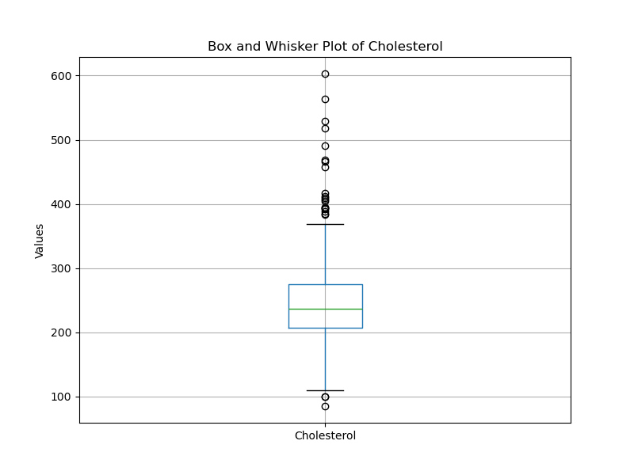
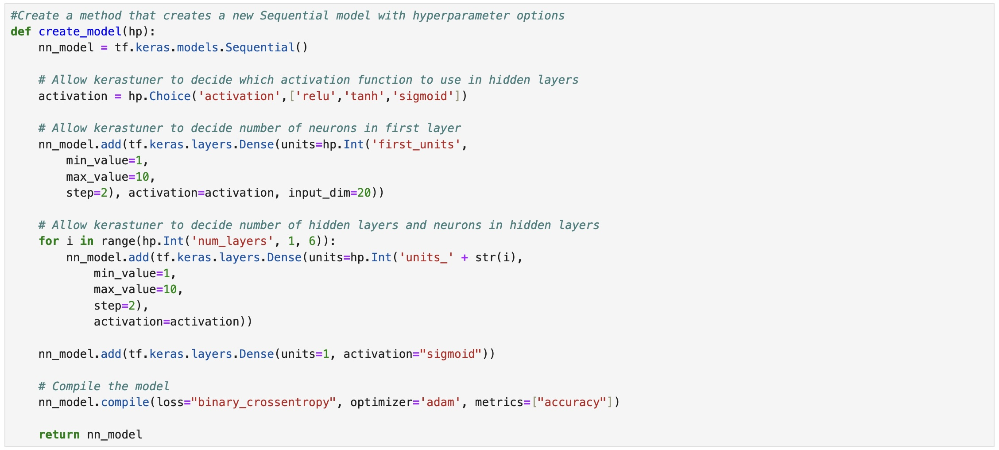
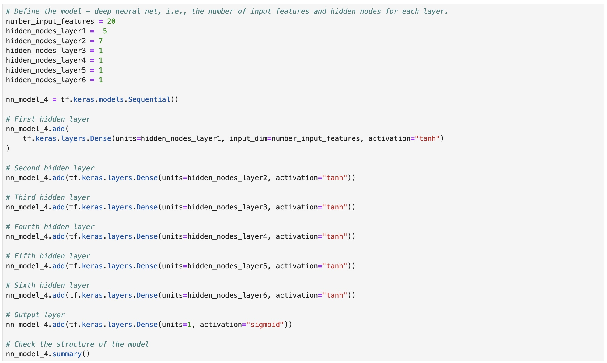
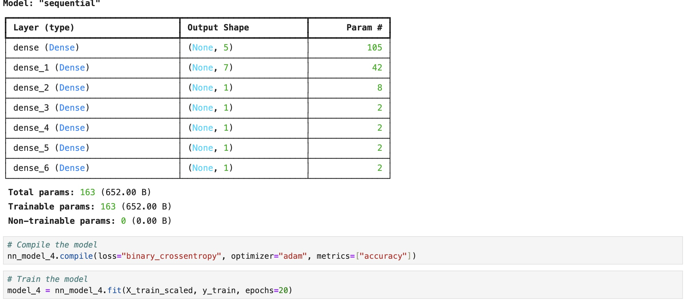
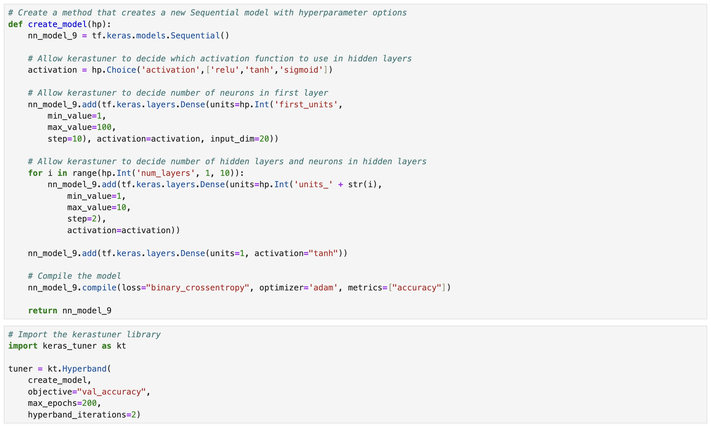
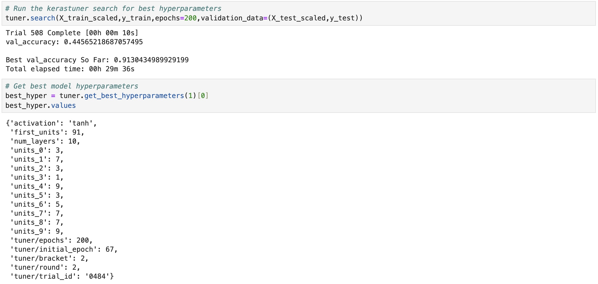

# coronary-disease-predictive-model
Collaborators: Jack Runge, Eric Price, Jesse Joffray, Andrew Mack

## Table of Contents
1. [Overview](#overview)
2. [Repo Contents](#repo-contents)
3. [Exploratory Data Analysis](#exploratory-data-analysis)
4. [Feature Information](#feature-information)
5. [Data Cleaning](#data-cleaning)
6. [Model Results](#model-results)
7. [Conclusions](#conclusions)
8. [Resources](#resources)

## Overview
This project is attempting to predict coronary heart disease using deep learning models as well as other classifiers to identify whether or not a patient is likely to have heart disease. In addition, the features used for in input in our models will be investigated to determine which, if any, have the most impact on the outcome of heart disease. As a result, this project will be used to both predict heart disease in patients and give recommendations to healthcare professionals to give to their patients on how to mitigate their chance for heart disease. 

## Repo Contents
- README.md
- Data_Cleaning.ipynb
- initial_EDA.ipynb
- model_optimization.ipynb
- resources holding our data files
- resouorces/images holding our graphs and charts of analyses conducted throughout this project
- model_tracking holds our information about model metrics and iterative improvements to our models
- initial_data holds all our trials for our hyperband tuner

## Exploratory Data Analysis
One of the first things we noticed when exploring the data was that 172 patients had a cholesterol value of zero recorded in the data. Since this value is nonsensical for cholesterol, several methods to address this issue were implemented in the Data_Cleaning.ipynb notebook. 
> Ranges for total cholesterol in adults
    - Normal: Less than 200 mg/dL
    - Borderline high: 200 to 239 mg/dL
    - High: At or above 240 mg/dL
> 
In addition, we also noted that one patient had a resting blood pressure value of zero in the dataset so this was similarly addressed in the Data_Cleaning.ipynb notebook. 

We created a hyperband tuner using the keras tuner package in python to test a wide range of model parameters for our deep learning model. In addition, we wanted to compare how the models performed with different levels of data cleaning performed on our initial dataset. We started off with a small number of epochs (20) to give a rough picture of how each dataset impacted our model's performance. While the difference was small, the dataset in which we replaced the cholesterol values with the median value of the dataset performed the best, leading us to further optimize our model with that dataset in mind.

## Feature Information
1. Age: age of the patient [years]
2. Sex: sex of the patient [M: Male, F: Female]
3. ChestPainType: chest pain type [TA: Typical Angina, ATA: Atypical Angina, NAP: Non-Anginal Pain, ASY: Asymptomatic]
4. RestingBP: resting blood pressure [mm Hg]
5. Cholesterol: serum cholesterol [mm/dl]
6. FastingBS: fasting blood sugar [1: if FastingBS > 120 mg/dl, 0: otherwise]
7. RestingECG: resting electrocardiogram results [Normal: Normal, ST: having ST-T wave abnormality (T wave inversions and/or ST elevation or depression of > 0.05 mV), LVH: showing probable or definite left ventricular hypertrophy by Estes' criteria]
8. MaxHR: maximum heart rate achieved [Numeric value between 60 and 202]
9. ExerciseAngina: exercise-induced angina [Y: Yes, N: No]
10. Oldpeak: oldpeak = ST [Numeric value measured in depression]
11. ST_Slope: the slope of the peak exercise ST segment [Up: upsloping, Flat: flat, Down: downsloping]
12. HeartDisease: output class [1: heart disease, 0: Normal]

## Data Cleaning
To tackle the problem of zero values for cholesterol in our dataset, first we just removed all the rows with the faulty values and exported the dataset as heart_no_zeros.csv. Then, we analyzed the cholesterol variable for the remaining rows to investigate any trends. 

This plot reveals that the distribution of cholesterol is skewed to the right with several large outliers. This information led us to decide to replace the zero values in the dataset with the median cholesterol value. This methodology allowed us to maintain as much data as possible without throwing away valuable rows. 

## Model Optimization

### PHASE I
* This initial phase of testing was designed to run light hyperparameter tuner models (limited epochs, iterations and range of layers/neurons)
* The goal of these attempts was to determine which dataset would be the best to move forward with
* Each attempt ran 30 trials

#### Results
* Attempt 1 (original dataset, unaltered) - Accuracy: 87.83%, Loss: .3509
* Attempt 2 (patients with no cholesterol value dropped) - Accuracy: 87.70%, Loss: .3734
* Attempt 3 (cholesterol value replaced) – Accuracy: 88.26%, Loss: .3902

* Based on these results, we decided to move forward with the dataset using replaced cholesterol values

### PHASE II
* Goal of Phase II was to use sequential modeling to see if we could improve upon the initial hyperparameter tuner model (Attempt 3)
* Tried to maintain a “scientific” approach by changing one thing at a time
* Attempt 4 - Utilized “Best Model” output
* This model was created by attempting to mirror the optimal model that came out of our hyperparamter tuning attempt #3
* Utilized 6 hidden layers with the tanh activation function and a sigmoid output layer.

#### Attempt 4 (Base Model) - 86.96% accuracy, .5190 loss

* Attempts 5-8 use model 4 as a base model and control one aspect of model architecture at a time
Layers, Activation Functions, Number of Neurons and Epochs

#### Attempt 5 (Manipulating Layers) - 88.04% accuracy, .3711 loss
* Changing number of layers - 
* Adding additional layers can give the model additional capacity to capture intricate relationships within the data. Each layer can learn different levels of abstraction, and potentially improving accuracy. Additional layers can be highly beneficial in solving complex problems. Conversely, too many layers may lead to overfitting of the data to the training set. Though we are showing just one attempt at changing the number of layers, we did find that adding additional layers beyond what we show in attempt #4 lead to a decrease in accuracy. Here we reduced the number of layers to see if that creates higher accuracy within the test set; interestingly, accuracy increased by roughly 1%.

#### Attempt 6 (Increased Epochs) - 84.78% accuracy, .4190 loss
* Changed number of epochs, 20 to 80 - 
In attempt #6 we used the same base architecture as attempt 4 to isolate epochs and control the other variables.
Controlling those variables and keeping them the same would allows us to isolate the number of epochs and see if that would result in higher accuracy.
An increased number of epochs gives the model more opportunities to learn from the data and adjust weights, but too many may overfit the model to the training dataset.
As can be seen, increasing the number of epochs from 20 to 80 instead yielded a decrease in accuracy over attempt #4, and thus still unable to achieve the results of attempt #3 with the hyperparamter tuner.
#### Attempt 7 (More Activation Functions) - 84.78% accuracy, .4190 loss
* Changing activation functions:¶
* 1st hidden layer - tanh
* 2nd hidden layer - tanh
* 3rd hidden layer - relu
*  4th hidden layer - sigmoid
* 5th hidden layer - tanh
* 6th hidden layer - tanh
* output layer - sigmoid

* In attempt #7 we attempted to utilize different activation functions, such as relu and sigmoid in the hidden layers. This can affect how the model interprets and transforms the inputs. Different activation functions have different properties and can capture different types of non-linearities, that may better suit the problem at hand, potentially leading to increased accuracy. In this case, it did not yield a meaningful increase in accuracy over prior attempts, while loss of roughly .55 indicates increased prediction error in this model variation over prior attempted configurations.

#### Attempt 8 (More Neurons) - 86.41% accuracy, .5504 loss
* Changing the number of Neurons in each layer - 
With attempt #8, we looked at the effect of increasing the number of neurons. All other variables we kept the same as attempt #4 to isolate the change in results.
By increasing the number of neurons in a layer, the model can potentially capture more complex patterns in the data. This allows for better representation of the underlying relationships between the features and the target variable, potentially leading to higher accuracy.
An increase in neurons appears to have an affect in reducing the error, given the reduced loss over many previous attempts; however, accuracy remains roughly that of the prior attempts.

### Results: No increase in accuracy. 
**note - even through various attempts not recorded (there were many), overfitting was a consistent issue.

## PHASE III - More Robust Hyperparameter Attempts

* Attempts 9-10 (with several run in each) focused on running more robust models with more epochs, a large range of layers, initial neurons and iterations tested
Ran 508-762 trials with some run times over 1 hour!
* Attempts 9.1-9.4 done using dataset with replaced cholesterol values

#### Attempt 9.1 - 88.04% accuracy, .4489 loss, 508 trials, 26 mins 49 secs
#### Attempt 9.2- 88.59% accuracy, .3700 loss, 762 trials, 45 mins 24 secs
#### Attempt 9.3 - 88.04% accuracy, .8813 loss, 508 trials, 27 mins, 27 secs
#### Attempt 9.4 - 91.30% accuracy, 35.91% loss, 508 trials, 29 mins 36 secs
 

* As you can see Attempt 9.4 yielded the best model so far, resulting in 91.3% accuracy
**** We may want to look at the output here and comment on it. ****

## Attempt 10…

Our very first attempt at running any models was a more robust hyperparameter tuner model run on the original dataset which ran for over 30 minutes with no end in site. To the point that we actually had to stop it. It resulted in accuracy of about 91%
This guided us to our approach in attempts 1-3 to use a simple model for the sake of time.
After attempts 3-9.3 never reached that level of accuracy, we decided to use a similar model to attempts 9 on the original, unaltered dataset (attempt 10.1 came before attempt 9.4)

* Attempt 10.1: 92.93% accuracy: .4741 loss, 508 trials, 1 hour, 14 mins, 21 secs
* Attempt 10.1: 90.70% accuracy, 36.92% loss, 508 trials, 52 mins, 32 secs

Hypothesis: Perhaps somewhere in the 508 trials the tuner ran a model that either ignored or weighted cholesterol values, resulting in much higher accuracy. With more time, we would like to understand this better and determine if possibly dropping the cholesterol column altogether gets better results, which is counter intuitive.

## Model Results

I.) Basic summary of dataset and objectives
    a.) Overall objective
    b.) What are our variables
    b.) how did we explore discrepancies and how did we account for them
i.) i.e. Cholesterol values, touching on our analysis of mean/median and the possibility of using k-means
    c.) Maybe touch on our storage of data in SQLite here, since it’s not a main feature.
II.) Exploration of initial datasets (original, zeros dropped and zeros replaced) using hyperparamater tuner
    a.) I think this can be high level just to show that we were able to determine the csv with     
    Replaced values was the most effective.
III.) Touch on our attempts to utilize sequential models to have more control of model architecture.
    a.) Why did we choose to use certain activation functions in our initial attempt (because     
    It’s what hyperparameter model suggested…)
    b.) Maybe show how we chose to run it a few more times changing neurons, layers,     
    Activation functions, etc.
        ii.) Ultimately, even if this shows we weren’t able to get lift with this, we can
            Highlight that we explored it.
IV.) This section is either “nice to have” or “where does it fit”
    a.) 
    b.) K-means
    c.) classification analysis
d.) Final Hyperparameter model - after concluding that sequential model wasn’t any better, do we take one more run at dialing in hyperparameter tuner?? I think keeping the hyperparameter examples simple in the early part of the project makes sense and serves it’s purpose to ask which dataset  is best(original, zeros dropped, zeros replaced). But maybe we want to circle back on one final model…

## Conclusions
    a.) The Hyperband Tuner search model got the highest accuracy with blank and a good loss value of blank.
    b.) ST_Slope_Up and MaxHR were good negative indicators of heart disease. ST_Slope_Flat and Oldpeak were positive indicators of heart disease
    c.) Bigger dataset would be better
    d.) More complete data on cholesterol would be better (88.4% of the patients who had zeros for cholesterol values had heart disease).
    e.) We could try other classifier models, other activation functions for our deep learning models, and different clustering models to replace our cholesterol values. 

## Resources
- Data source: https://www.kaggle.com/datasets/fedesoriano/heart-failure-prediction/data
- Related coronary medical study: https://pubmed.ncbi.nlm.nih.gov/2756873/
- [1]: Cholesterol guidance:
https://www.hopkinsmedicine.org/health/treatment-tests-and-therapies/lipid-panel#:~:text=Here%20are%20the%20ranges%20for,200%20to%20239%20mg%2FdL 
- Imputation best practices: https://www.simplilearn.com/data-imputation-article#:~:text=about%20Multiple%20Imputations.-,What%20Is%20Data%20Imputation%3F,from%20a%20dataset%20each%20time
- A Guide to any Classification Problem: https://www.kaggle.com/code/durgancegaur/a-guide-to-any-classification-problem 
